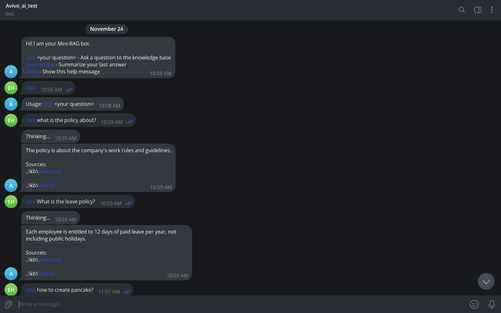
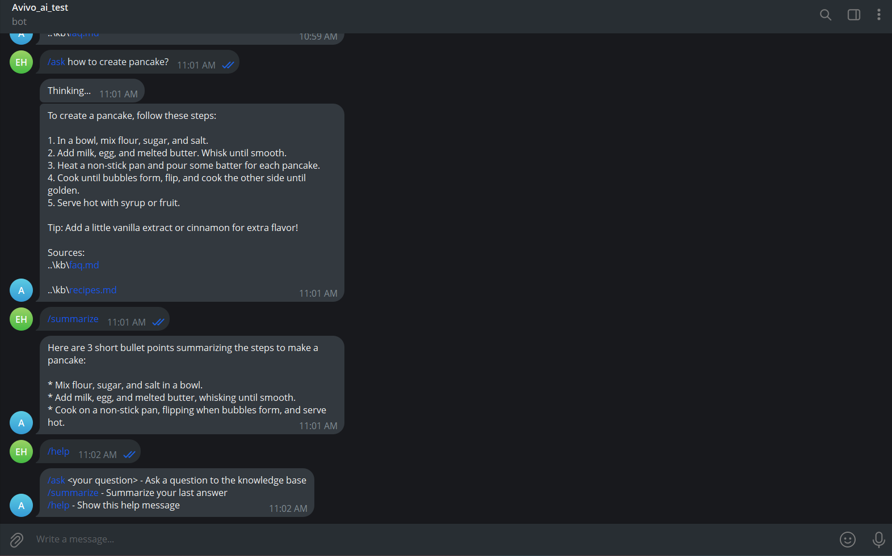

# Avivo Mini-RAG Telegram Bot

A lightweight Retrieval-Augmented Generation (RAG) chatbot that answers knowledge base questions via Telegram. Combines Python, FAISS for vector search, sentence-transformers for embeddings, a fast LLM API (OpenAI or Hugging Face), and an interactive Telegram interface.

---






## 📌 Features

- 🔍 Mini-RAG system: FAISS + sentence-transformers for top-k retrieval
- 🤖 Telegram bot: `/ask`, `/summarize`, `/help`, `/start` commands
- 📚 Markdown knowledge base (company policies, recipes, FAQs)
- ⚡ Efficient local FAISS index for instant look-up
- 🧠 Modern LLM API (OpenAI or HuggingFace Inference) for answer generation
- 🗂️ Shows which document sources were used in every answer
- 📝 Maintains user session history (last 3 queries) for summarization
- 📦 Clean, modular codebase (`src/bot.py`, `src/rag_core.py`)
- 🖼️ Demo screenshots included

---

## 🧰 Tech Stack & Components Used:


| Category           | Name / Version                                    | Purpose                                   |
|--------------------|---------------------------------------------------|-------------------------------------------|
| Language           | Python 3.10+                                      | Core implementation                       |
| Embeddings Model   | sentence-transformers/all-MiniLM-L6-v2            | Text chunk embedding for RAG              |
| Vector Store       | FAISS                                              | Efficient similarity search               |
| LLM (Inference)    | Meta Llama-3 3B Instruct via HuggingFace Inference| Response generation for retrieved context |
| Tokenizer          | HuggingFace Tokenizers                            | Used internally by HF models              |
| RAG Pipeline       | Custom retrieval + generation logic               | Chunking, embedding, search, synthesis    |
| Telegram Integration| python-telegram-bot                              | Chatbot interface                         |
| Serialization      | Pickle (.pkl) files                               | Embedding cache, metadata, chunks         |
| Environment        | .env + python-dotenv                              | API key management                        |
| Utilities          | tqdm, dotenv, os, pickle                          | Helper functionality                      |

---

## 🏗️ System Architecture

```

                 ┌─────────────────────────┐
                 │       Telegram User      │
                 └──────────────┬───────────┘
                                │
                                ▼
                    ┌────────────────────┐
                    │     bot.py         │
                    │ Telegram Interface │
                    └──────────┬─────────┘
                               │
                               ▼
                     ┌────────────────────┐
                     │    rag_core.py     │
                     │  RAG Pipeline      │
                     └──────────┬─────────┘
                                │
               ┌─────────────────────────────┐
               ▼                             ▼
    ┌────────────────────┐        ┌─────────────────────────┐
    │   FAISS Index      │        │    LLM Inference API    │
    │   (vector store)   │        │(OpenAI/Hugging Face LLM)│
    └──────────┬─────────┘        └─────────────┬──────────┘
               │   Top-k chunks                 │
               └─────────┬─────────────┬────────┘
                         ▼
              ┌────────────────────┐
              │    Final Answer    │
              │    + Sources       │
              └──────────┬─────────┘
                         │
                         ▼
              ┌────────────────────┐
              │ Telegram Response  │
              └────────────────────┘
    ```
```

## 📁 Project Structure

```

avivo-mini-rag-bot/
│
├── kb/
│   ├── code.ipynb               \# Development notebook
│   ├── faiss_index.bin          \# FAISS vector index
│   ├── metadata.pkl             \# Metadata for chunks
│   ├── faq.md                   \# Example markdown knowledge file
│   ├── policy.md
│   ├── recipes.md
│   ├── kb_chunks.pkl
│   └── embed_cache.pkl
│
├── src/
│   ├── bot.py                   \# Telegram bot logic
│   └── rag_core.py              \# RAG core pipeline
│
├── .env                         \# API keys/secrets (not versioned)
├── requirements.txt
│
├── DataScience_Assignment.docx   \# Problem statement (if provided)
├── Screenshot_1.png              \# Demo: /ask query
└── Screenshot_2.png              \# Demo: /summarize

```

---

## ⚙️ Setup Instructions

**1. Extract the project:**
Download and extract the provided avivo-mini-rag-bot.zip file into any folder.
```

avivo-mini-rag-bot/


```

**2. Create a virtual environment (recommended):**
```

python -m venv venv

# macOS/Linux:
source venv/bin/activate

# Windows:
venv\Scripts\activate

```

**3. Install dependencies:**
```

pip install -r requirements.txt

```

**4. Configure environment variables:**
Create a file `.env` in the root folder with:
```

TELEGRAM_BOT_TOKEN=your_telegram_token
HUGGINGFACEHUB_API_TOKEN=your_hf_token

```

**5. Run the bot:**
```

python src/bot.py

```

---

## 🧠 RAG Details

- **Embedding Model:** `sentence-transformers/all-MiniLM-L6-v2`
    - Fast, accurate, small memory
- **Vector Retriever:** `FAISS`
    - Fast local similarity search
- **LLM (Answer Generation):**
    -  HuggingFace Inference (reliable, simple)
- **Modularity:** All RAG logic in `rag_core.py`, bot logic in `bot.py`. Easy to swap out LLM backends.

---

## 🧪 Commands

| Command      | Description                     |
|--------------|---------------------------------|
| `/ask <q>`   | Ask a question from the KB      |
| `/summarize` | Summarize last answer           |
| `/help`      | Bot usage instructions          |
| `/start`     | Welcome message                 |

---

## 🖼️ Demo Screenshots

| Screenshot         | Description               |
|--------------------|--------------------------|
| Screenshot_1.png   | Bot answering `/ask`     |
| Screenshot_2.png   | Bot answering `/summarize`|

---

## 🎯 Evaluation 

| Area           | How This Project Addresses It                                            |
|----------------|-------------------------------------------------------------------------|
| Code Quality   | Clean, modular structure (`rag_core.py`, `bot.py`), minimal dependencies.|
| System Design  | Clear flow: User → Bot → RAG → FAISS → LLM Model → Response.             |
| Model Use      | Lightweight models (MiniLM + LLM API) chosen for speed and simplicity.   |
| Efficiency     | Cached embeddings, FAISS index, top-k retrieval keep responses fast.      |
| User Experience| Clear answers, source references, `/summarize` support, simple commands. |
| Innovation     | Adds per-user history + summarization for enhanced interaction.           |


## 🎯 Conclusion

This project fulfills the assignment with:
- A true Mini-RAG pipeline
- Telegram bot interface
- Source-based answers & summaries
- Fast FAISS retrieval
- Open, clean, modular code
- Configurable LLM backend (HF)
